[English](README.md) · **Deutsch**
[English](README.md) · **Deutsch**

# Lumio

**Self-hosted Foto- und Video-Galerie für Fotograf:innen und Studios.**
Self-hostbare Alternative zu Picdrop, Pixieset und Pic-Time — Daten bleiben bei dir.

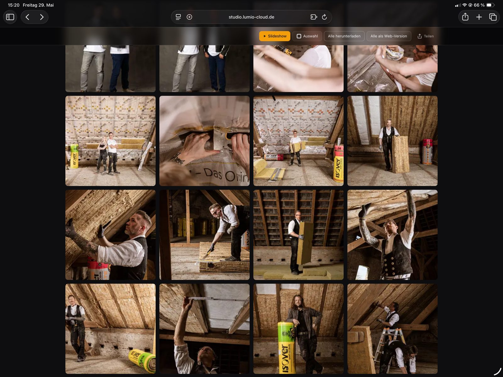

---

## Für wen ist Lumio?

Drei typische Setups – das Quick-Start unten deckt den ersten ab, alles andere ist optional.

| Du bist… | Setup | Doku |
|---|---|---|
| **Fotograf:in oder Studio** | Single-Mode, MinIO, eine Domain | [Quick Start](#quick-start) — 5 Minuten |
| **Agentur mit mehreren Fotograf-Kunden** (selbst hostend, für die eigene Geschäftstätigkeit) | Multi-Mode ohne Billing, Tenants manuell per Super-Admin | [docs/MULTI_TENANT.md](docs/MULTI_TENANT.de.md) |

Im **Single-Mode** wird der Tenant beim ersten Start automatisch angelegt – du brauchst nur `create-admin` für deinen ersten User. Kein Super-Admin, kein Stripe.

> **Lumio als SaaS an zahlende Dritte anbieten?** Das ist *Competing Use* und unter der Lizenz nicht ohne Weiteres erlaubt (es ist das Geschäftsmodell hinter unserem eigenen lumio-cloud.de). Dafür gibt es eine kommerzielle Lizenz auf Anfrage – siehe [Lizenz](#lizenz). Der SaaS-Modus ist unter [docs/SAAS_MODE.md](docs/SAAS_MODE.de.md) dokumentiert.

---

## Features

- 🚀 **Schnell** — Direkt-zu-S3-Uploads, virtualisierte Galerien, libvips-Thumbnails
- 📷 **RAW-Support** — CR2, CR3, NEF, ARW, RAF, DNG, ORF, PEF, RW2, X3F via LibRaw
- 🎬 **Video-Streaming** — HLS Adaptive Bitrate, Scrubbing-Previews, Poster-Frames
- 💬 **Proofing** — Likes, Color-Tags, Star-Ratings, Kommentare, Zeichen-Markierungen auf Foto **und Video** (zeitgebunden), Team-Voting
- 🎨 **Whitelabel** — Logo, Farben, Custom Domains pro Studio oder Galerie
- 🔐 **Sicher** — Signed URLs, Argon2-Passwörter, Audit-Log
- ☁️ **Storage-flexibel** — MinIO, S3, R2, B2, Wasabi, Hetzner Object Storage
- 🐳 **Docker-First** — `docker compose up` und es läuft

Das Studio — Galerien verwalten, Smart Collections, Tag-Filter, Team-Proofing:

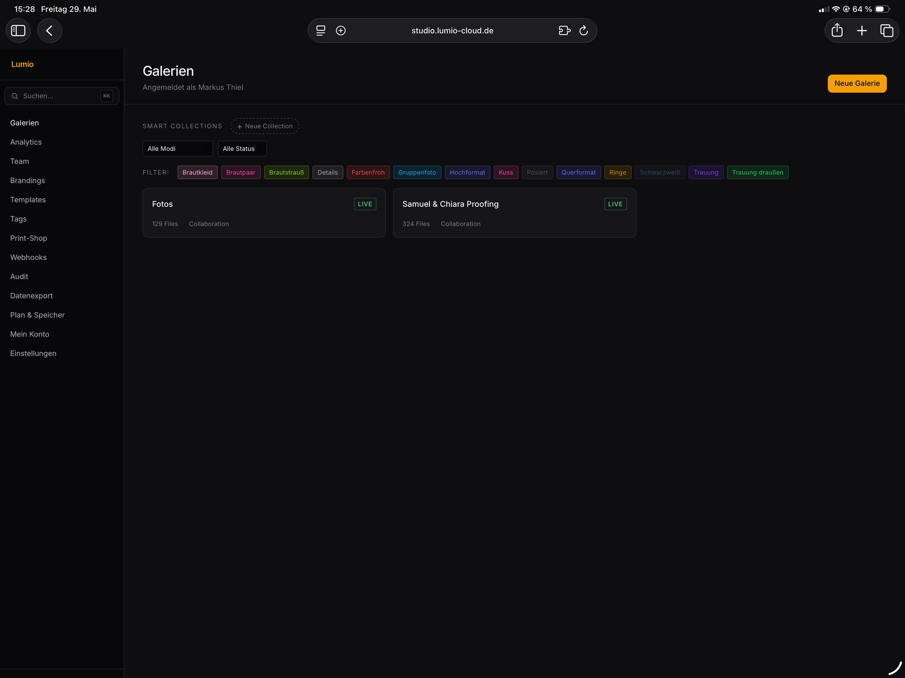

---

## Einblicke

**Proofing & Annotation** — Kunden liken, vergeben Color-Tags und zeichnen Markierungen direkt aufs Bild, mit Kommentaren pro Foto.

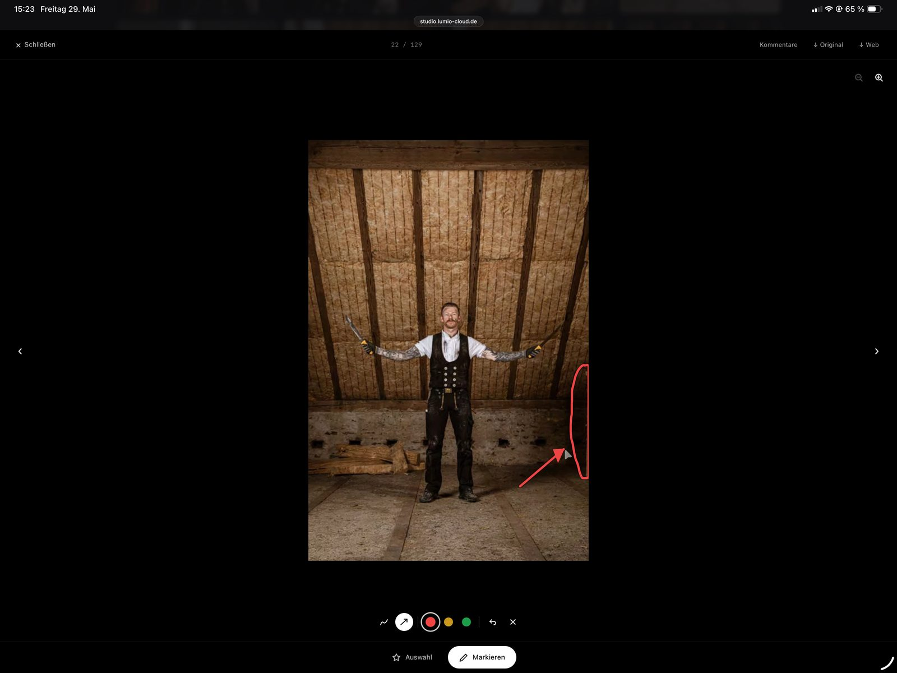

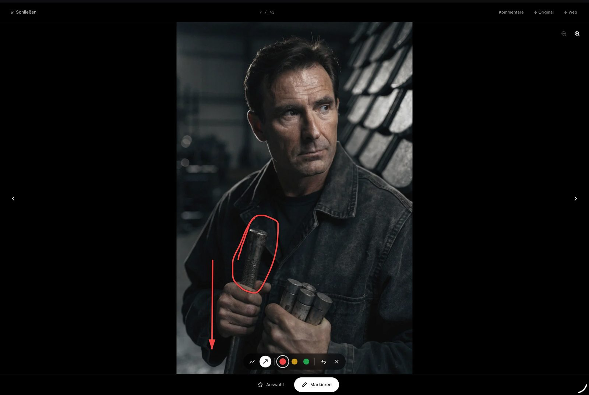

**Video-Proofing** — Auch Bewegtbild wird abgenommen wie ein Foto: Kunden scrubben per Filmstrip durch das Video, setzen Markierungen an einem bestimmten Zeitpunkt und zeichnen direkt aufs Standbild — mit optionaler Notiz pro Markierung.

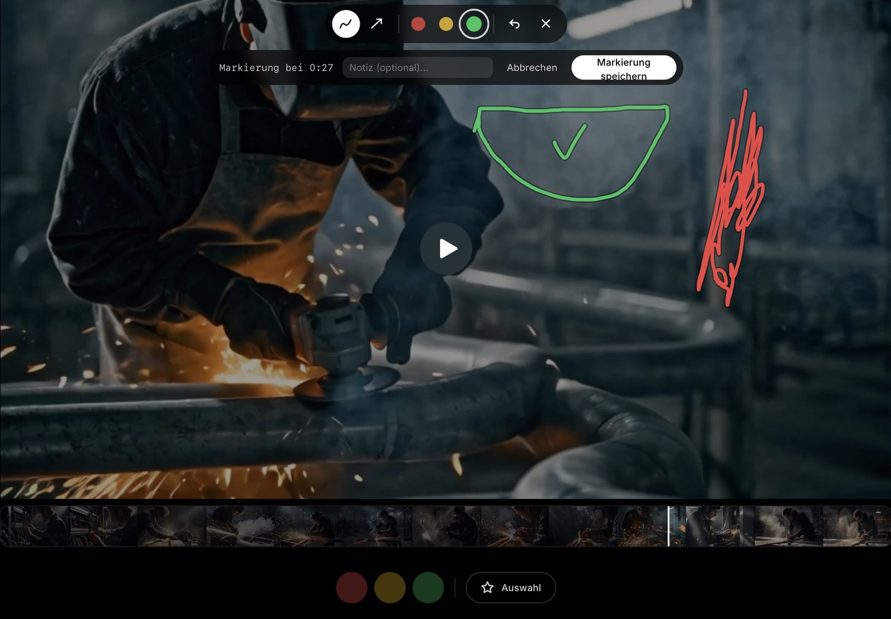

Scrubbing per Filmstrip — beim Ziehen über die Leiste zeigt eine Vorschau den jeweiligen Frame samt Zeitstempel:

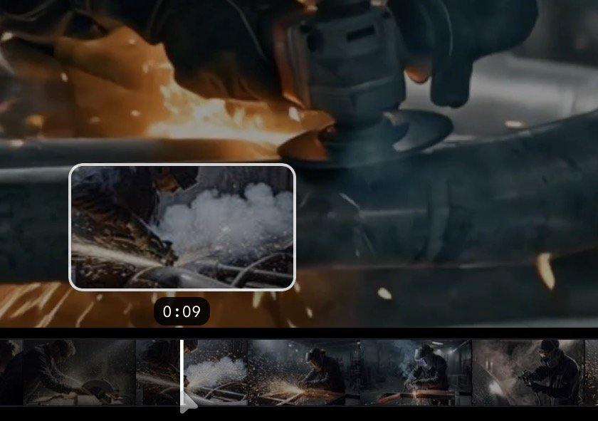

**Upload & Formate** — Drag & Drop mit parallelen Uploads, Duplikat-Erkennung und Smart-Sections. JPEG, PNG, WebP, RAW, HEIC/HEIF, Video und PDF — bis zum konfigurierbaren Datei-Limit.

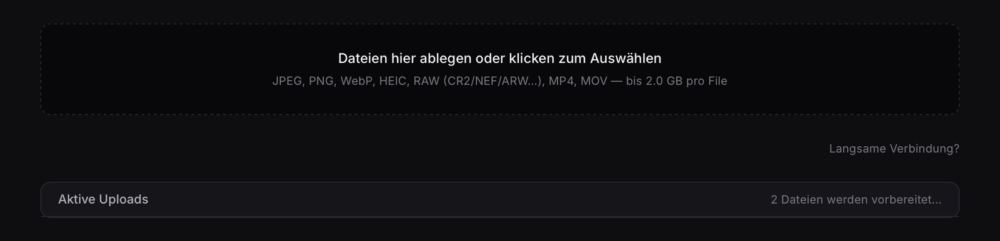

**KI-Auto-Tagging** — Bilder werden automatisch verschlagwortet (CLIP-Modell), Vorschläge lassen sich per Confidence-Schwelle filtern und übernehmen. Kunden können optional nach Tags filtern.

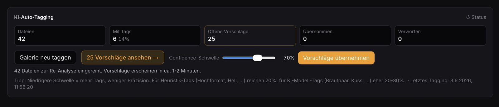

**Galerie-Gestaltung** — Pro Galerie: Layout, Bilder-Anordnung, Slideshow-Übergänge, Hero-Bild, Event-Logo, Farben. Whitelabel bis ins Detail.

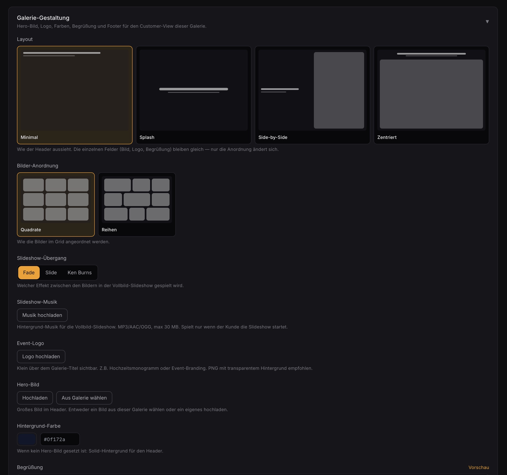

**Analytics** — Aufrufe, beliebteste Bilder, Downloads und ein Engagement-Funnel von Besuch bis Bestellung.

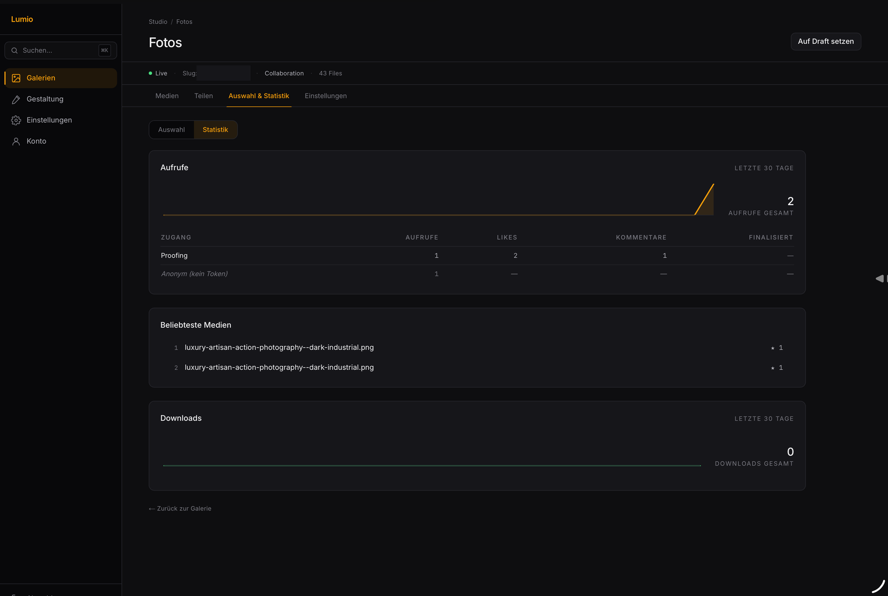

**Print-Shop** — Verkaufe Prints, Leinwände und Fotobücher direkt aus der Galerie. Eigene Anbieter, Produkte, Versand, optional mit Stripe-Bezahlung.

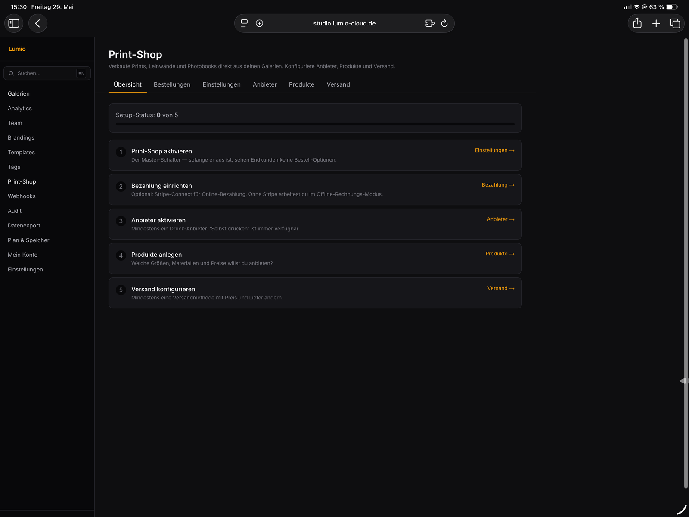

**Sicherheit & DSGVO** — Auftragsverarbeitungsvertrag nach Art. 28 DSGVO elektronisch abschließbar, Share-Links mit Ablauf und Passwort, Audit-Log und Zwei-Faktor-Authentifizierung.

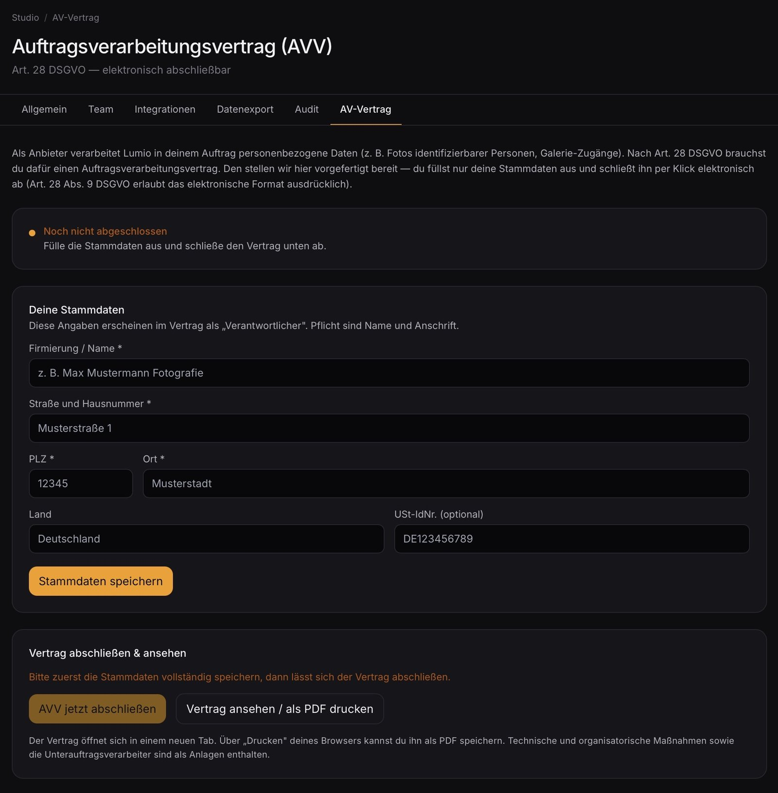

**Webhooks & Integrationen** — Externe Tools per HTTP-POST über Galerie-Ereignisse informieren. Jeder Request wird mit deinem Webhook-Secret signiert.

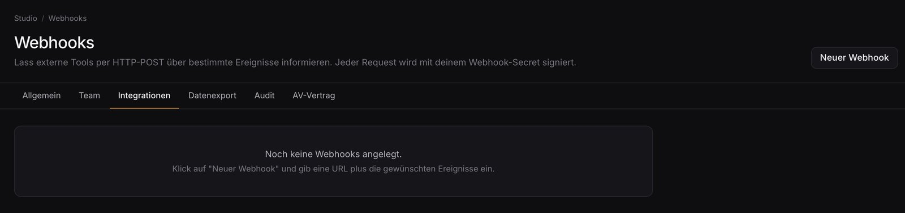

**Hell- oder Dunkel-Modus** — Das Studio-Backend in Hell oder Dunkel, mit eigener Akzentfarbe und Logo-Varianten für beide Modi. (Die übrigen Screenshots hier zeigen den Dunkel-Modus.)

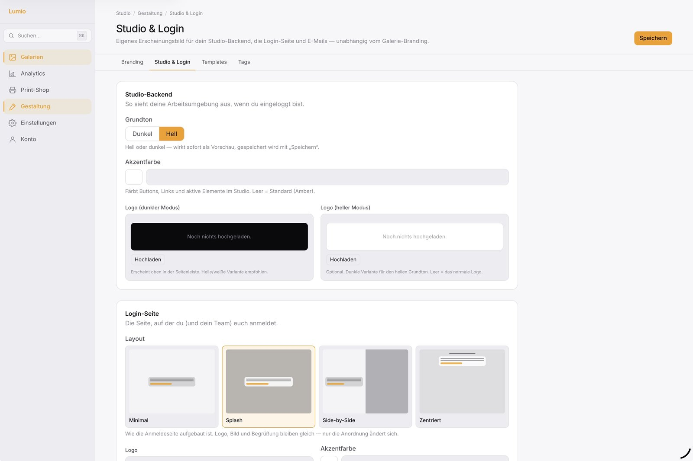

---

## Quick Start

**5 Minuten von Null zu erster Galerie.** Voraussetzungen: Docker + Docker Compose v2 (amd64 oder arm64). Details: [docs/REQUIREMENTS.de.md](docs/REQUIREMENTS.de.md).

### 1. Repo holen und Secrets setzen

```bash
git clone https://github.com/markusthiel/lumio.git
cd lumio
cp .env.example .env

# Sichere Passwörter generieren und einsetzen
sed -i "s|^POSTGRES_PASSWORD=.*|POSTGRES_PASSWORD=$(openssl rand -base64 24 | tr -d '/+=')|" .env
sed -i "s|^JWT_SECRET=.*|JWT_SECRET=$(openssl rand -base64 32 | tr -d '/+=')|" .env
sed -i "s|^SESSION_SECRET=.*|SESSION_SECRET=$(openssl rand -base64 32 | tr -d '/+=')|" .env
sed -i "s|^S3_ACCESS_KEY=.*|S3_ACCESS_KEY=$(openssl rand -hex 12)|" .env
sed -i "s|^S3_SECRET_KEY=.*|S3_SECRET_KEY=$(openssl rand -base64 32 | tr -d '/+=')|" .env
```

### 2. Starten

```bash
docker compose up -d
```

Das baut die Container und startet Postgres, Redis, MinIO, API, Frontend, Worker und Caddy. Der erste Start dauert 3–5 Min (Build + DB-Migration).

Status prüfen:

```bash
docker compose ps
```

Alle Services sollten `running` (healthy) sein.

### 3. Admin-User anlegen

```bash
docker compose exec api npm run create-admin -- \
  --email=du@example.com \
  --password=mindestens12zeichen \
  --name="Dein Studio"
```

### 4. Einloggen

Im Browser:

→ **http://localhost** (Studio-Login)

Nach dem Login findest du oben links die Galerie-Erstellung. Lade ein Foto hoch, teile den Galerie-Link — fertig.

---

## Es läuft. Was jetzt?

- **Eigene Domain dranhängen** → [docs/SELFHOSTING.de.md](docs/SELFHOSTING.de.md) (15-Min-Setup mit HTTPS)
- **Bilder gehen verloren beim Container-Restart?** → MinIO speichert im `minio_data`-Volume, das persistiert. Sicher dass du das Volume nicht versehentlich `docker volume rm`'st.
- **Backups einrichten** → [docs/BACKUP.md](docs/BACKUP.de.md)
- **Was läuft schief?** → [docs/TROUBLESHOOTING.md](docs/TROUBLESHOOTING.de.md)

---

## Architektur

```
┌──────────┐    ┌──────────┐    ┌────────────────┐
│ Frontend │◄──►│   API    │◄──►│ Postgres/Redis │
│ Next.js  │    │ Fastify  │    │  + S3 Storage  │
└──────────┘    └────┬─────┘    └────────────────┘
                     │
                     ▼
                ┌─────────┐
                │ Worker  │  RAW decode, Thumbnails,
                │ Python  │  Video transcode, ZIP build
                │ Celery  │
                └─────────┘
```

- **`apps/frontend`** — Next.js 16 (App Router) + Tailwind
- **`apps/api`** — Fastify + Prisma (Postgres) + BullMQ (Redis)
- **`apps/worker`** — Python + Celery + rawpy/pyvips/ffmpeg
- **`packages/shared`** — Geteilte TypeScript-Typen + Zod-Schemas
- **`infra/`** — Caddy-Config, Postgres-Init

---

## Erweiterte Setups

Alles optional. Das Quick-Start oben reicht für ein einzelnes Studio.

| Szenario | Doku |
|---|---|
| Production hinter eigener Domain mit HTTPS | [docs/SELFHOSTING.de.md](docs/SELFHOSTING.de.md) |
| Mehrere Studios auf einer Instanz | [docs/MULTI_TENANT.md](docs/MULTI_TENANT.de.md) |
| SaaS-Modus mit Stripe-Billing | [docs/SAAS_MODE.md](docs/SAAS_MODE.de.md) |
| GPU-Beschleunigung (NVENC + KI-Tags) | [docs/GPU.md](docs/GPU.de.md) |
| KI-Auto-Tagging (CLIP) | [docs/ML.md](docs/ML.de.md) |
| Tenant-Subdomains via Wildcard-Cert | [docs/WILDCARD.md](docs/WILDCARD.de.md) |
| Last auf mehrere Server verteilen | [docs/SCALING.md](docs/SCALING.de.md) |
| Externes S3 statt MinIO (R2, B2, Hetzner, Wasabi) | [docs/STORAGE.md](docs/STORAGE.de.md) |
| Backups, Migrationen, Re-Queue | [docs/OPERATIONS.md](docs/OPERATIONS.de.md) |
| Mitwirken / Entwicklung | [docs/DEVELOPMENT.md](docs/DEVELOPMENT.md) |

---

## Lizenz

[Functional Source License 1.1 (FSL-1.1-ALv2)](LICENSE) — eine *source-available* Lizenz (nicht OSI-Open-Source).

**Erlaubt für jeden:**
- Privatpersonen, Profi-Fotograf:innen und Studios: nutzen, self-hosten, anpassen — auch kommerziell für die eigene Geschäftstätigkeit
- Agenturen: Lumio im Rahmen von Dienstleistungen für die eigenen Kund:innen betreiben

**Nicht erlaubt:**
- Ein konkurrierendes, gehostetes SaaS-/Cloud-Angebot aufbauen, das dieselbe oder eine im Wesentlichen ähnliche Funktionalität wie Lumio Dritten als Produkt anbietet (*Competing Use*)

**Zeitlich begrenzt:** Jede Version wird zwei Jahre nach ihrer Veröffentlichung automatisch unter der [Apache License 2.0](http://www.apache.org/licenses/LICENSE-2.0) verfügbar — dann ohne Einschränkung.

Für ein gehostetes/konkurrierendes Angebot ist eine kommerzielle Lizenz auf Anfrage möglich.

---

## Mitwirken

Pull Requests willkommen. Siehe [CONTRIBUTING.md](CONTRIBUTING.md).

Issues & Diskussionen: https://github.com/markusthiel/lumio/issues
